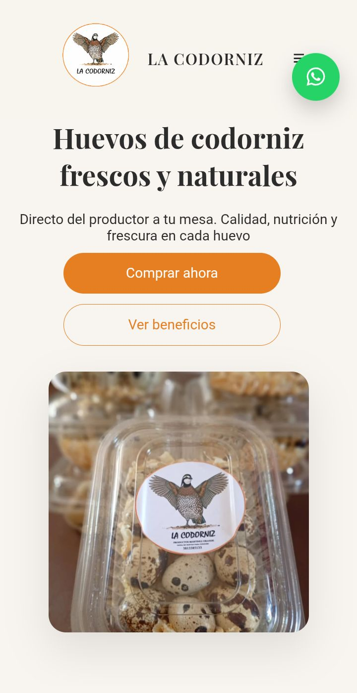

# 🍽 La Codorniz - Landing Page

Landing page desarrollada para un negocio gastronómico, diseñada para presentar servicios, generar confianza y facilitar el contacto con clientes.

Este proyecto forma parte de mi portfolio como desarrollador web, enfocado en la creación de páginas para negocios reales.

---

## 🚀 Demo

---

## 🖼 Vista del proyecto

---

## 🛠 Tecnologías utilizadas

- HTML5
- CSS3
- JavaScript

---

## 📂 Características

✔ Diseño moderno y limpio  
✔ Adaptado a dispositivos móviles  
✔ Secciones claras de información  
✔ Enfoque en conversión de clientes  
✔ Optimizado para negocios locales  

---

## 🎯 Objetivo del proyecto

Este proyecto fue desarrollado para:

- Practicar desarrollo de landing pages
- Crear una web para un negocio real
- Generar una presencia online clara y profesional

---

## 👨‍💻 Autor

Carlos Daniel Martínez  

GitHub  
https://github.com/carlosdm121
